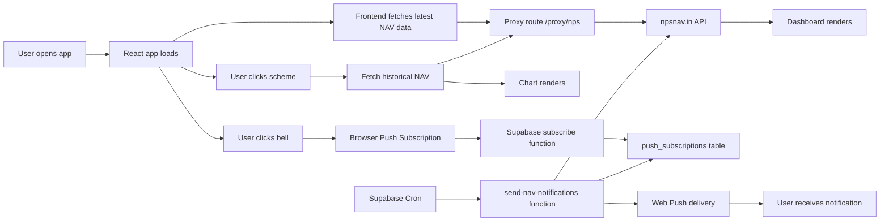
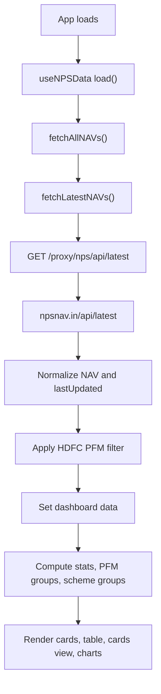
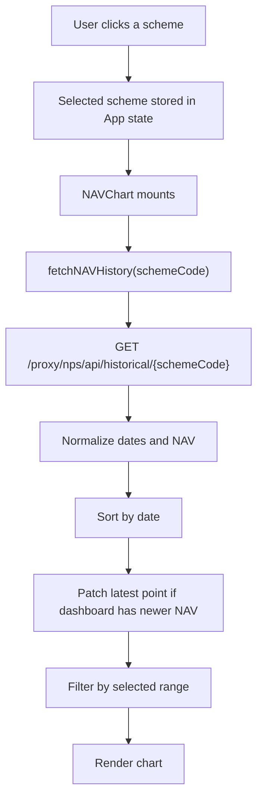
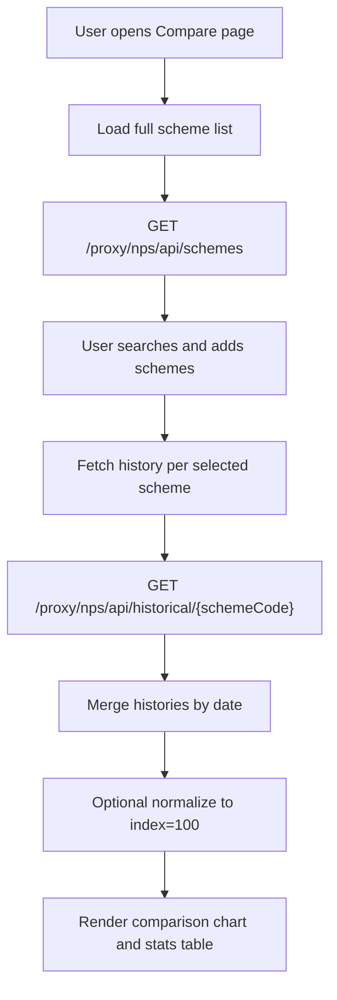
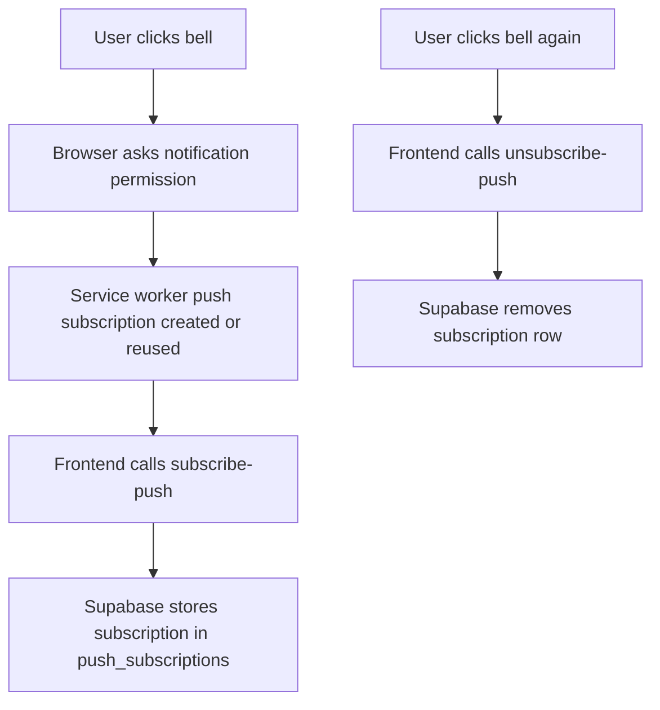
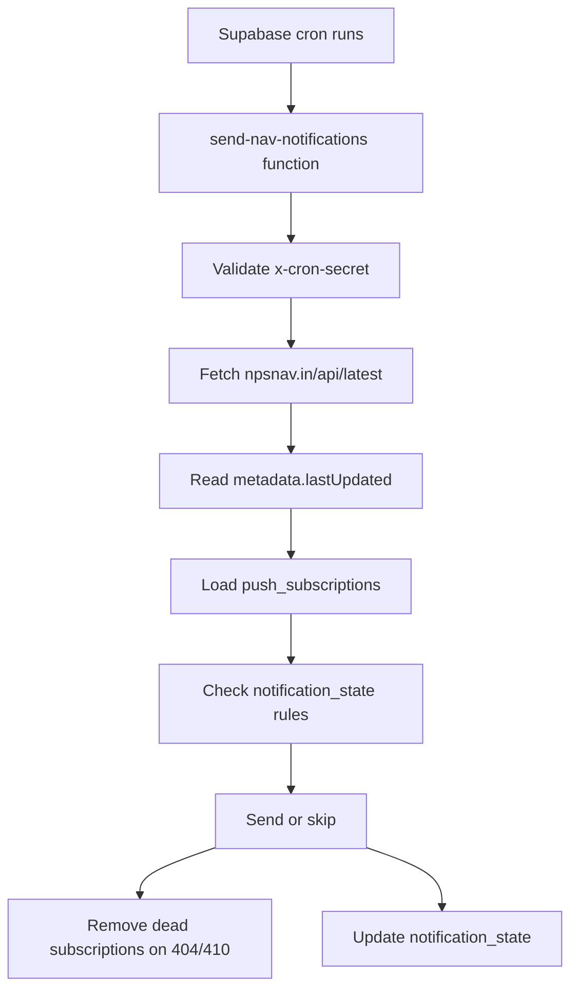
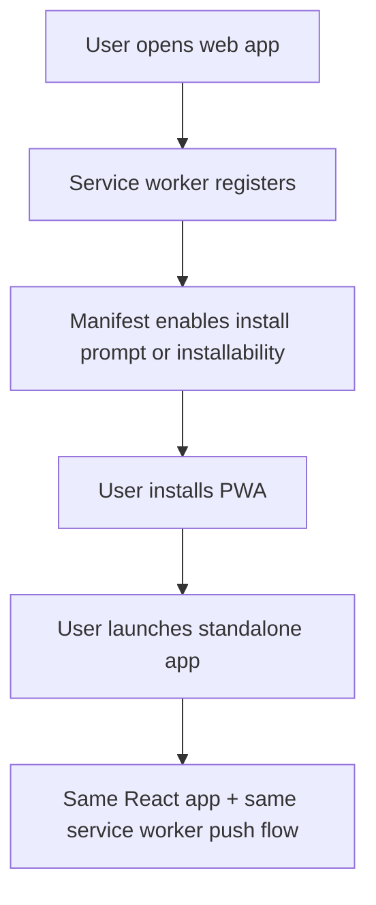

# NPS Dashboard Project Flow

## 1. What This Application Is

This project is a React + Vite Progressive Web App (PWA) for tracking National Pension System (NPS) NAV data.

It has 3 major product areas:

- Dashboard for current NAV tracking
- Comparison page for historical NAV analysis across schemes
- Push notification system for morning and night NAV alerts

The app is designed so users can use it:

- in the browser
- as an installed PWA on desktop
- as an installed PWA on supported mobile devices

## 2. Main Technology Stack

- Frontend: React + Vite
- Charts: Recharts
- Data requests: Axios + browser fetch
- PWA layer: Web App Manifest + Service Worker
- Push transport: Web Push + VAPID
- Notification backend: Supabase Edge Functions
- Notification storage: Supabase Postgres
- Scheduled jobs: Supabase Cron

## 3. High-Level Architecture

## 4. Main Files and Their Responsibilities

### Frontend App Shell

- [App.jsx](/D:/NPS/nps-dashboard/src/App.jsx)
  Main page composition, dashboard/compare tabs, selected scheme chart behavior

- [main.jsx](/D:/NPS/nps-dashboard/src/main.jsx)
  React bootstrap and service worker registration

- [Header.jsx](/D:/NPS/nps-dashboard/src/components/Header.jsx)
  Top bar, refresh button, theme toggle, bell icon, updated date

### NAV Data Layer

- [npsApi.js](/D:/NPS/nps-dashboard/src/api/npsApi.js)
  All NAV API calls and normalization

- [useNPSData.js](/D:/NPS/nps-dashboard/src/hooks/useNPSData.js)
  Main dashboard data fetching, refresh, summary derivation

### Dashboard UI

- [NAVTable.jsx](/D:/NPS/nps-dashboard/src/components/NAVTable.jsx)
  Searchable/sortable table and mobile list

- [SchemeCard.jsx](/D:/NPS/nps-dashboard/src/components/SchemeCard.jsx)
  Card view for schemes

- [NAVChart.jsx](/D:/NPS/nps-dashboard/src/components/NAVChart.jsx)
  Historical chart for one selected scheme

- [PFMBreakdown.jsx](/D:/NPS/nps-dashboard/src/components/PFMBreakdown.jsx)
  PFM visualization

### Comparison UI

- [ComparisonPage.jsx](/D:/NPS/nps-dashboard/src/components/ComparisonPage.jsx)
  Multi-scheme history comparison across PFMs

### Push Notifications

- [NotificationBell.jsx](/D:/NPS/nps-dashboard/src/components/NotificationBell.jsx)
  Bell icon UI

- [usePushNotifications.js](/D:/NPS/nps-dashboard/src/hooks/usePushNotifications.js)
  Browser push permission + subscription lifecycle

- [pushApi.js](/D:/NPS/nps-dashboard/src/api/pushApi.js)
  Frontend calls to Supabase Edge Functions

### Supabase Backend

- [subscribe-push](/D:/NPS/nps-dashboard/supabase/functions/subscribe-push/index.ts)
  Stores push subscriptions

- [unsubscribe-push](/D:/NPS/nps-dashboard/supabase/functions/unsubscribe-push/index.ts)
  Removes push subscriptions

- [send-nav-notifications](/D:/NPS/nps-dashboard/supabase/functions/send-nav-notifications/index.ts)
  Fetches latest NAV data, decides whether to send, sends notifications

### PWA Files

- [manifest.json](/D:/NPS/nps-dashboard/public/manifest.json)
  App install metadata

- [sw.js](/D:/NPS/nps-dashboard/public/sw.js)
  Service worker for app shell caching and push handling

## 5. How NAV Data Is Fetched

### Proxy Layer

The frontend does not call `https://npsnav.in` directly in code.

It uses:

- `/proxy/nps`

This proxy is mapped to `https://npsnav.in` in:

- [vite.config.js](/D:/NPS/nps-dashboard/vite.config.js)
- [vercel.json](/D:/NPS/nps-dashboard/vercel.json)

### API Endpoints Used

Current code uses these upstream endpoints:

- `GET /api/latest`
- `GET /api/schemes`
- `GET /api/historical/{schemeCode}`
- `GET /api/{schemeCode}` exists in code but dashboard now primarily uses `/api/latest`

### Current Data Strategy

#### Dashboard

Dashboard uses:

- `fetchLatestNAVs()`
- then `fetchAllNAVs()`

This means the dashboard is now driven by:

- `npsnav.in/api/latest`

and not by one request per scheme.

#### Historical Chart

Single scheme chart uses:

- `npsnav.in/api/historical/{schemeCode}`

#### Comparison Page

Comparison page uses:

- `/api/schemes` to load the searchable scheme list
- `/api/historical/{schemeCode}` for each selected scheme

## 6. Dashboard Data Workflow

## 7. Historical Chart Workflow

## 8. Comparison Page Workflow

## 9. What Data Is Actually Visible

### Important Rule

The app shows the latest NAV date that `npsnav.in` has made available.

It does not invent a newer NAV date.

### Header Date

The header shows the API freshness date from:

- `metadata.lastUpdated` from `/api/latest`

This means if the header says:

- `26 Mar 2026`

then the dashboard is showing NAV data that is current up to 26 Mar 2026.

### Dashboard Date

Each scheme row/card also carries:

- `Last Updated`

which is normalized from the API response.

### Chart Date

The chart shows the latest history date from `/api/historical/{schemeCode}`.

If that history is lagging by one day but dashboard latest data is newer, the app appends the dashboard latest point.

This helps reduce the “history only catches up after noon” issue.

## 10. Real-World Date Examples

### Example A: Morning before upstream publishes new date

- User opens app on `27 Mar 2026` at `8:00 AM IST`
- `/api/latest.metadata.lastUpdated = 2026-03-26`

User sees:

- Header: `26 Mar 2026`
- Dashboard table/cards: 26 Mar NAV values
- Chart last point: usually 26 Mar, unless history is still lagging

Conclusion:

- The visible NAV date is 26 Mar, not 27 Mar

### Example B: Same day, history endpoint is lagging

- User opens app on `27 Mar 2026` at `10:30 AM IST`
- `/api/latest` already has 26 Mar
- `/api/historical/{schemeCode}` still ends at 25 Mar

User sees:

- Dashboard row: 26 Mar NAV
- Chart: app injects a 26 Mar latest point if the selected dashboard scheme has that latest date

Conclusion:

- The app tries to keep the chart aligned with the latest dashboard data

### Example C: Night before latest date is published

- At `27 Mar 2026 11:00 PM IST`
- `/api/latest.metadata.lastUpdated` is still `2026-03-26`

Night function behavior:

- Skip send
- Reason: latest NAV date has not reached today yet

### Example D: Night after latest date appears

- At `27 Mar 2026 11:30 PM IST`
- `/api/latest.metadata.lastUpdated = 2026-03-27`

Night function behavior:

- Send one night notification
- Store `last_night_notified_date = 2026-03-27`
- 11:45 PM retry skips duplicate send

### Example E: Morning summary the next day

- At `28 Mar 2026 7:30 AM IST`
- `/api/latest.metadata.lastUpdated = 2026-03-27`

Morning behavior:

- Send morning notification
- Message is based on latest available NAV date

## 11. Current Data Scope

### Dashboard Scope

The dashboard is currently filtered to:

- `HDFC`

because [npsApi.js](/D:/NPS/nps-dashboard/src/api/npsApi.js) uses:

- `const PFM_FILTER = 'HDFC'`

So:

- Dashboard = HDFC-focused latest NAV view
- Compare page = any PFM, any scheme

### Notification Scope

Notification payloads are also currently HDFC-focused because:

- `send-nav-notifications` filters schemes whose name includes `HDFC`

## 12. Auto Refresh Behavior

The dashboard auto-refreshes every 5 minutes through [useNPSData.js](/D:/NPS/nps-dashboard/src/hooks/useNPSData.js).

Refresh triggers are:

- initial page load
- every 5 minutes
- manual refresh button click

This affects:

- latest NAV values
- header updated date
- stats
- scheme table/cards

## 13. Push Notification Workflow

### Frontend Push Flow

From [usePushNotifications.js](/D:/NPS/nps-dashboard/src/hooks/usePushNotifications.js):

- On mount, app checks for an existing Push API subscription
- If found, it syncs that subscription to Supabase
- On subscribe:
  - request permission
  - reuse existing subscription if present
  - otherwise create a new subscription
  - send subscription JSON to Supabase
- On unsubscribe:
  - remove from Supabase
  - unsubscribe browser push
  - clear local state

### Backend Push Flow

From [subscribe-push](/D:/NPS/nps-dashboard/supabase/functions/subscribe-push/index.ts):

- Accepts `subscription`
- Extracts `endpoint`
- Upserts into `push_subscriptions`

From [unsubscribe-push](/D:/NPS/nps-dashboard/supabase/functions/unsubscribe-push/index.ts):

- Accepts `endpoint`
- Deletes matching row

## 14. Notification Sending Workflow

### Morning Mode

Morning mode:

- sends once per India date
- does not require latest NAV date to equal today
- acts as a summary of the latest currently available NAV date

Stored state key:

- `last_morning_notified_date`

### Night Mode

Night mode:

- only sends if `/api/latest.metadata.lastUpdated` equals today’s India date
- sends once per NAV date
- retry windows later that night skip if already sent

Stored state key:

- `last_night_notified_date`

## 15. Current Notification Schedule

Configured schedule logic is:

- Morning: `7:30 AM IST`
- Night retries:
  - `11:00 PM IST`
  - `11:15 PM IST`
  - `11:30 PM IST`
  - `11:45 PM IST`

Night sends only if the latest NAV date has actually reached that same India date.

## 16. PWA Workflow

### Service Worker Behavior

From [sw.js](/D:/NPS/nps-dashboard/public/sw.js):

- app shell is cached
- non-proxy GET requests can be cached
- `/proxy/*` requests are not cached and use direct network fetch
- push notifications are displayed through `self.registration.showNotification`
- notification click reopens or focuses the app

### Important Consequence

Because `/proxy/*` is not cached by the SW:

- stale latest NAV is usually not caused by PWA cache
- it is more likely caused by upstream data publication timing

## 17. Environment Variables and Secrets

### Frontend

Needed in frontend environment:

- `VITE_VAPID_PUBLIC_KEY`
- `VITE_SUPABASE_URL`
- `VITE_SUPABASE_ANON_KEY`

### Supabase Function Secrets

Needed in Supabase secrets:

- `PROJECT_URL`
- `SERVICE_ROLE_KEY`
- `VAPID_PUBLIC_KEY`
- `VAPID_PRIVATE_KEY`
- `VAPID_EMAIL`
- `CRON_SECRET`

## 18. Database Requirements

The backend assumes these database objects exist:

- `push_subscriptions`
- `notification_state`

And cron-based HTTP calling requires:

- `pg_cron`
- `pg_net`

Without `pg_net`, cron jobs fail with:

- `schema "net" does not exist`

## 19. Known Operational Caveats

### 1. Upstream freshness still controls visible NAV date

Even though the chart patch reduced lag, the app still depends on `npsnav.in` publishing latest data.

If upstream still says yesterday:

- header shows yesterday
- dashboard shows yesterday
- night notification skips

### 2. Dashboard is HDFC-only

This is intentional in current code, but it means:

- the app is not yet a full all-PFM latest dashboard

### 3. Compare and Dashboard are not symmetrical

Dashboard:

- latest NAV snapshot
- HDFC filtered

Compare:

- all schemes
- historical only

### 4. Notification UI currently has limited visible error feedback

The push hook stores errors, but the bell UI does not clearly render them to users yet.

## 20. End-to-End User Journeys

### Journey A: User opens dashboard

1. App loads
2. Latest NAV data fetched from `/api/latest`
3. HDFC filter applied
4. Header updated date is shown
5. User sees HDFC scheme list, stats, cards, table

### Journey B: User inspects one scheme

1. User clicks scheme row/card
2. Chart opens
3. Historical NAV is fetched
4. Latest dashboard NAV point is appended if needed
5. User sees latest visible NAV date in chart header

### Journey C: User compares across PFMs

1. User opens Compare page
2. App fetches all scheme list
3. User adds up to 6 schemes
4. Histories load independently
5. Comparison chart and performance table render

### Journey D: User subscribes to notifications

1. User clicks bell
2. Browser permission prompt appears
3. Subscription is created or reused
4. Supabase stores the subscription
5. User becomes eligible for cron-based alerts

### Journey E: Morning notification

1. Morning cron runs
2. Sender fetches latest NAV data
3. If morning notification not already sent today, send
4. Update morning state key

### Journey F: Night retry notifications

1. 11:00 PM cron runs
2. If latest NAV date has not reached today, skip
3. 11:15 PM retry runs
4. 11:30 PM retry runs
5. Once latest NAV date reaches today, send once
6. Later retries skip duplicates

## 21. Practical Summary

This application is best understood as:

- a PWA NAV dashboard
- powered by `npsnav.in`
- with latest HDFC dashboard data
- with cross-PFM historical comparison
- and with Supabase-based browser push notifications

The key operational truth is:

- users always see the latest NAV date that the upstream API has actually published
- the app now surfaces that date honestly
- and the notification system is designed around that reality

